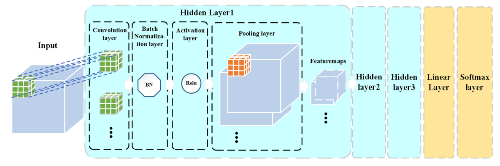

# Interpretable Deep Learning for Pattern Recognition in Brain Differences Between Men and Women

We analyze data provided by The Human Connectome Project (HCP).  Using diffusion MRI data we solve the problem of binary classification of finding the sex of an person using 3D-CNN. Further we intepret obtained model to undestand of male-female brain differencies. 

## Setup and Dependencies

Install all dependencies with 

```bash
pip install -r ./requirements.txt
```


## DATABASE 

The data we use is an open-access database taken from Human Connection Project (HCP). We worked with tabular description of MPI data  and DTI preprocessed MRI data(maps of factional anisotropy(FA tensor) as a result). 

Data contain 1113 subjects, including 507 men and 606 women. Each object is represented by a 1 GB ZIP archive with a name corresponding to a unique object ID. Each archive contains a lot of information. For automatic access to the target MRI file, the power shell script was written that can be found in 

```bash
./data/DATE_ACCESS.md
```

The script allows you to extract the necessary file from the internal ZIP archive(inside the main archive), without unzipping the main one. Also, a unique ID corresponding to each object is assigned as a name for each file.


## Masks
To obtain all masks use 

```bash
./masks/obtain_masks.ipynb
```


## CNN Model

To train the 3D CNN models use 

```bash
./model3d/training_model.ipynb
```




## Meaningful perturbation
[3D visualization of mask](https://maxs-kan.github.io/InterpretableNeuroDL/mask.html)


## GradCAM


## Guided backpropagation

