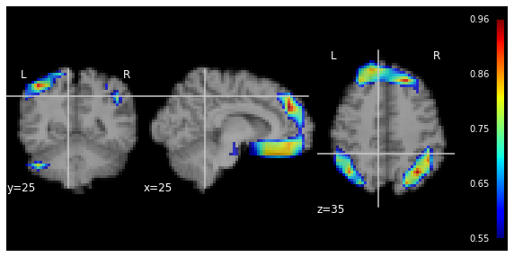
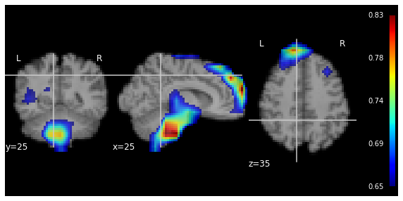
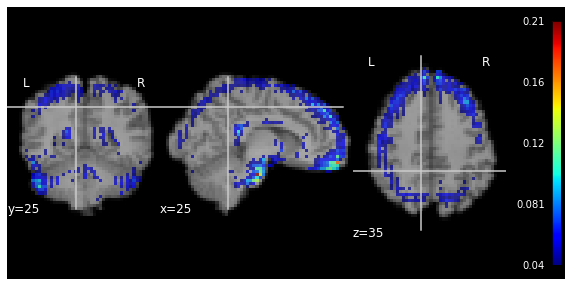

# Interpretation of 3D CNNs for Brain MRI Data Classification

We analyze data provided by The Human Connectome Project (HCP).  Using T1-weighted MRI data we solve the problem of binary classification of task of gender patterns recognition between men and women with 3D - CNN. Further we intepret obtained model to undestand of gender-related brain differencies. 

Please refer to the [sourse](https://arxiv.org/abs/2006.15969) paper. 

## Setup and Dependencies

Install all dependencies with 

```bash
pip install -r ./requirements.txt
```


## DATABASE 

The data we use is an open-access database taken from Human Connection Project (HCP). We worked with morphometry description of T1 MPI images as wel as the full-sized images preprocessed in `Freesurfer` according to the HCP pipeline.

Data contain 1113 subjects, including 507 men and 606 women. Each object is represented by a 1 GB ZIP archive with a name corresponding to a unique object ID. Each archive contains a lot of information. For automatic access to the target MRI file, the power shell script was written that can be found in 

```bash
./data/DATE_ACCESS.md
```

The script allows you to extract the necessary file from the internal ZIP archive(inside the main archive), without unzipping the main one. Also, a unique ID corresponding to each object is assigned as a name for each file.


## Masks
To obtain all masks use 

```bash
./masks/obtain_masks.ipynb
```


## CNN Model

To train the 3D CNN models use 

```bash
./model3d/training_model.ipynb
```


Architecture reproduced from the paper [Brain Differences Between Men and Women: Evidence From Deep Learning](https://www.frontiersin.org/articles/10.3389/fnins.2019.00185/full)

## Meaningful perturbation
[3D visualization of mask](https://maxs-kan.github.io/InterpretableNeuroDL/mask.html)


Interpretation with meaningful perturbation:



## GradCAM

Interpretation with Grad CAM:



## Guided backpropagation

3D CNN Interpretation with Guided backpropogation:


